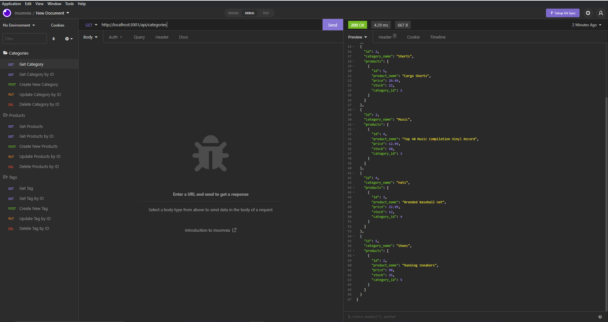
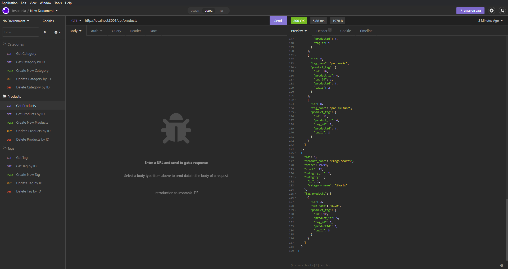
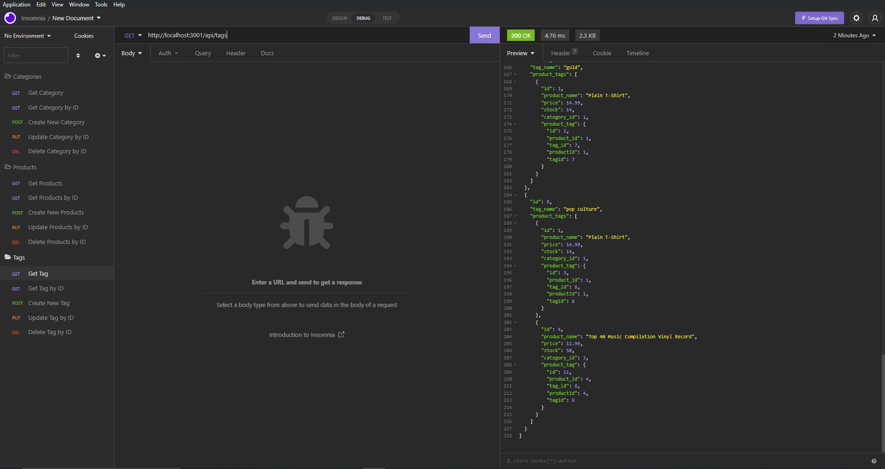

# OUTSIDE-SHOPPING

## Description

Outside Shopping is a back end application that allows e-commerce companies to store, update, and delete data in order to organize inventory efficiently. When the server is started and Sequelize models are synced to the MySql workbench, the user is able to use Insomnia to create, read, update, and delete data for categories, products, and tags.

## Installation

User will need to fork or clone this repository to use its functions. User also need to have MySql workbench, as well as Insomnia or Postman. User needs to npm i to install necessary packages for the application to run.

## Screenshots

## Live Demo

* https://drive.google.com/file/d/15uaIpFSLvv0tHQmJP4kKGT8ME6guDdoe/view